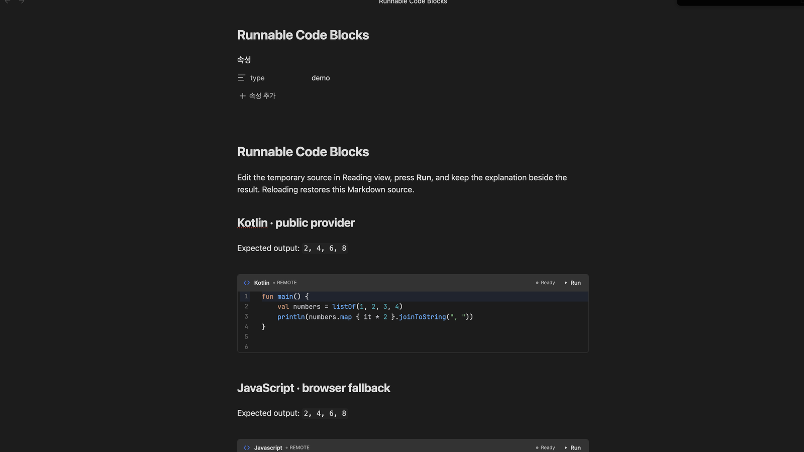
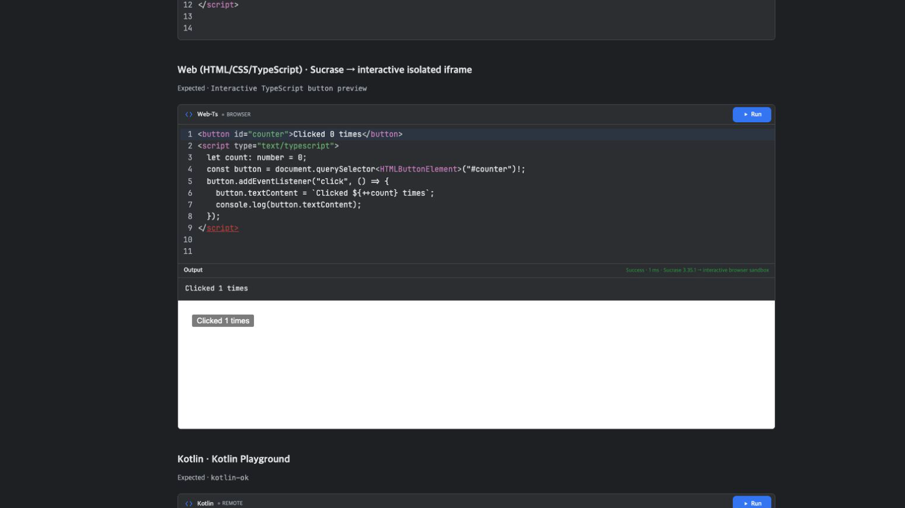

# Runnable Code Blocks

<p align="center">
  <a href="obsidian://show-plugin?id=runnable-code-blocks"></a>
  <a href="https://github.com/woonyong-kr/obsidian-runnable-code-blocks/actions/workflows/ci.yml"></a>
  <a href="https://github.com/woonyong-kr/obsidian-runnable-code-blocks/releases/latest"></a>
  <a href="LICENSE"></a>
</p>

<p align="center">
  <strong>Run code where you learn.</strong><br />
  Turn Markdown examples into temporary IntelliJ-inspired editors in Obsidian and static websites.
</p>

<p align="center">
  <a href="obsidian://show-plugin?id=runnable-code-blocks">Add to Obsidian</a>
  ·
  <a href="https://woonyong-kr.github.io/obsidian-runnable-code-blocks/">Try the live editor</a>
  ·
  <a href="https://community.obsidian.md/plugins/runnable-code-blocks">View the Community page</a>
</p>




Runnable Code Blocks keeps the explanation, the experiment, and the result in one note. Readers edit a temporary copy, press **Run**, and see exactly which browser or public provider produced the output; the Markdown source stays portable and unchanged.

- **24 exact runnable fences** — 21 programming languages plus interactive JavaScript, TypeScript, and React documents.
- **No execution server to host** — browser-native runners and named public providers work in Obsidian and the static adapter.
- **Portable Markdown** — the document stores ordinary `run-<language>` fences instead of plugin-specific state.
- **Disposable editing** — change and run a sample freely; **Reset** or reopening the rendered note restores the Markdown source.
- **Visible execution boundaries** — every result names the browser or third-party provider that actually ran it.

## At a glance

| What you need | What the plugin does |
| --- | --- |
| Learn beside an explanation | Replaces `run-<language>` fences with temporary editable runners in Reading view |
| Keep Markdown portable | Stores only ordinary fenced code in the note; editor state and output are disposable |
| Avoid hosting a backend | Uses seven browser-native fences and named public execution providers |
| Publish the same lesson | Shares the parser, catalog, runner composition, editor, and output UI with the static adapter |
| Understand the trust boundary | Labels the selected provider before execution and keeps remote execution configurable |

## Try it in 60 seconds

1. Open [Runnable Code Blocks in Obsidian](obsidian://show-plugin?id=runnable-code-blocks), then install and enable it.
2. Paste this into a note:

````markdown
```run-kotlin
fun main() {
    val note = "Obsidian"
    println("Hello from $note!")
}
```
````

3. Open Reading view and select **Run**, or press <kbd>⌘</kbd>/<kbd>Ctrl</kbd> + <kbd>Enter</kbd> inside the editor.

The output appears directly beneath the code. **Reset** restores the current Markdown source; closing and reopening the rendered note discards its temporary edits.

For a clickable browser component, keep HTML, CSS, and JavaScript together in `run-web`:

````markdown
```run-web
<button id="counter">Clicked 0 times</button>
<script>
  let count = 0;
  const button = document.querySelector("#counter");
  button.addEventListener("click", () => {
    button.textContent = `Clicked ${++count} times`;
    console.log(button.textContent);
  });
</script>
```
````

Use `run-web-ts` and `<script type="text/typescript">` for the same component with TypeScript. Plain `run-typescript` remains an isolated console program, so existing notes do not silently gain DOM access.

For a React documentation-style component, use one self-contained JSX or TSX module:

````markdown
```run-react
import { useState } from "react";

export default function Counter() {
  const [count, setCount] = useState<number>(0);

  return (
    <button onClick={() => setCount((value) => value + 1)}>
      Clicked {count} times
    </button>
  );
}
```
````

`run-react` bundles React and ReactDOM with the plugin, accepts JSX and TSX in the same fence, automatically mounts the default component, and preserves the same Run, Console, error, Reset, and sandbox behavior. React and `react-dom/client` imports are available; arbitrary packages and relative multi-file imports are intentionally rejected so the note remains deterministic and server-free.

## What happens when you press Run

1. The exact fence chooses one entry from the shared language catalog.
2. The configured provider order selects a remote or browser-native adapter.
3. A preflight checks whether execution can start and the header names the selected environment.
4. The editor sends only the current temporary source to that adapter.
5. Output, errors, duration, and provider details appear inline without modifying the note.
6. Fallback is allowed only when the first adapter proves that execution never started.

This last rule avoids running the same program twice after a timeout or an unknown remote result.

## Where it helps

- Build programming notes that can be read and practiced in the same place.
- Turn tutorials and interview material into executable examples.
- Let readers experiment without copying every snippet into a separate IDE.
- Publish the same runnable Markdown through a static website adapter.

The UI follows an IntelliJ New UI-inspired editor and tool-window hierarchy: line numbers, Darcula syntax colors, a compact Run action, named provider status, and inline Output. Editors grow through 100 source lines plus two numbered editing lines before their own scrollbar appears.



## Supported languages

Version 0.4.0 defines the following stable fences. “Remote” means source is sent to the named provider; this project does not operate an execution server.

| Fence | Static web | Obsidian |
| --- | --- | --- |
| `run-javascript` | Wandbox → Web Worker | Wandbox → Web Worker |
| `run-typescript` | Wandbox → browser transpile/Worker | Wandbox → browser transpile/Worker |
| `run-python` | Wandbox | Wandbox |
| `run-sql` | Wandbox SQLite | Wandbox SQLite |
| `run-html` | Sandboxed preview iframe | Sandboxed preview iframe |
| `run-css` | Sandboxed preview iframe | Sandboxed preview iframe |
| `run-web` | Interactive isolated iframe | Interactive isolated iframe |
| `run-web-ts` | Sucrase → interactive isolated iframe | Sucrase → interactive isolated iframe |
| `run-react` | Bundled React + Sucrase → isolated iframe | Bundled React + Sucrase → isolated iframe |
| `run-kotlin` | Kotlin Playground | Kotlin Playground |
| `run-java` | Wandbox | Wandbox |
| `run-c` | Wandbox | Wandbox |
| `run-cpp` | Wandbox | Wandbox |
| `run-go` | Wandbox | Wandbox |
| `run-rust` | Wandbox | Wandbox |
| `run-csharp` | Wandbox | Wandbox |
| `run-swift` | SwiftFiddle | SwiftFiddle |
| `run-ruby` | Wandbox | Wandbox |
| `run-php` | Wandbox | Wandbox |
| `run-r` | Wandbox | Wandbox |
| `run-scala` | Wandbox | Wandbox |
| `run-dart` | DartPad compile API → isolated frame | DartPad compile API → isolated frame |
| `run-lua` | Wandbox | Wandbox |
| `run-shell` | Wandbox | Wandbox |

## Execution and privacy

Code runs only after **Run** or the keyboard shortcut. Treat every runnable block as executable code.

- Remote execution is enabled and remote-first by default so the same Markdown works on a static deployment.
- Settings can choose browser-first or disable remote execution. With remote execution disabled, JavaScript, TypeScript, HTML, CSS, Web, Web TypeScript, and React remain browser-native.
- JavaScript and transpiled TypeScript run in a fresh Web Worker with common network globals blocked, a five-second timeout, and termination after every run.
- HTML and CSS render in a sandboxed, script-disabled iframe with a restrictive Content Security Policy. CSS is applied to a reusable card, button, and text specimen.
- Interactive `run-web` documents may use inline HTML, CSS, and JavaScript inside a fresh opaque-origin iframe. `run-web-ts` transpiles `<script type="text/typescript">` blocks before using the same sandbox.
- `run-react` transpiles a self-contained JSX or TSX module with Sucrase and mounts its default export with bundled React and ReactDOM. Only `react`, `react-dom`, and `react-dom/client` imports are available; no package is downloaded while running a note.
- All interactive previews block Fetch/XHR/WebSocket calls, subresource loading, forms, popups, top navigation, objects, and same-origin access.
- Kotlin Playground, Wandbox, SwiftFiddle, and DartPad receive source only when their adapter is selected.
- The Community Plugin does not access the filesystem, spawn local processes, install runtimes, or modify `PATH`.

A fallback occurs only when execution is known not to have started. Compilation errors, program failures, timeouts with an unknown remote outcome, and non-zero exits never cause the same code to run again through another provider. See [runtime provider architecture](docs/runtime-providers.md) for the full contract.

## Settings

Open **Settings → Community plugins → Runnable Code Blocks**:

- **Remote execution** — allow or block source submission to named providers.
- **Provider order** — choose Remote → Browser or Browser → Remote.
- **Supported languages** — inspect the complete runtime map from the same catalog used by the plugin.

## Troubleshooting

- **Run is unavailable:** hover or focus the status text to see which provider preflight failed. Public providers can be temporarily unavailable.
- **Only seven fences work after disabling remote execution:** this is expected. JavaScript, TypeScript, HTML, CSS, Web, Web TypeScript, and React are browser-native.
- **A React import is rejected:** `run-react` deliberately includes only React and ReactDOM. Keep the example self-contained instead of importing arbitrary npm or relative modules.
- **Edits disappeared after Reset or reopening the note:** this is intentional. Change the Markdown source when you want to keep an example.
- **A program failed but no fallback ran:** compile errors, runtime failures, and unknown remote outcomes are completed attempts, so the plugin avoids executing the same code twice.

## Static website integration

The browser adapter recognizes ordinary rendered Markdown:

```html
<pre><code class="language-run-python">print("Hello")</code></pre>
```

It shares the fence parser, language catalog, runner composition, editor, and output UI with the Obsidian plugin. No API key, database, Vercel function, Supabase project, or project-owned backend is required. The deployed adapter is available as a [live 24-fence demo](https://woonyong-kr.github.io/obsidian-runnable-code-blocks/).

## Architecture and maintenance

Provider-specific change is isolated from the stable UI and Markdown contract:

- `src/supported-languages.ts` is the public support catalog and exact fence map;
- `src/runner-composition.ts` defines provider order and fallback composition;
- `src/runners/*-runner.ts` owns third-party URLs, request bodies, compiler selection, and response parsing;
- `src/contracts.ts` owns the portable fence and execution-result contracts;
- `src/editor.ts` and `src/ui.ts` own the IntelliJ-inspired editor and Output surface;
- `src/web-adapter.ts` adapts rendered static Markdown without importing Obsidian.

When a public provider changes, its adapter can be repaired and released without changing the Markdown syntax or the rest of the execution UI.

## Installation and compatibility

Install from **Settings → Community plugins → Browse → Runnable Code Blocks**. Version 0.4.0 supports Obsidian 1.13.0 or later on desktop and mobile.

For a manual release install, download `main.js`, `manifest.json`, and `styles.css` from the [latest release](https://github.com/woonyong-kr/obsidian-runnable-code-blocks/releases/latest) into `.obsidian/plugins/runnable-code-blocks/`, then reload Obsidian.

## Support

- Review [runtime providers](docs/runtime-providers.md) before reporting a provider outage.
- Read the [changelog](CHANGELOG.md) and [verification evidence](docs/verification.md).
- Open a [bug report](https://github.com/woonyong-kr/obsidian-runnable-code-blocks/issues/new) with the language, provider label, exact output, and Obsidian version.
- Review [Contributing](CONTRIBUTING.md) before submitting source changes.

## Development

Requirements:

- Node.js 22 or later
- Obsidian 1.13 or later

```bash
npm ci
npm run verify
npm run smoke:remote
```

`npm run verify` runs TypeScript and ESLint checks, Knip unused-code analysis, 79 isolated tests with coverage, production builds, release-policy validation, and an npm package dry run. `npm run smoke:remote` intentionally submits the public sample programs to third-party providers, so results remain provider-dependent.

The build creates:

- `main.js`, `manifest.json`, and `styles.css` for Obsidian;
- `dist-site/` for the static browser adapter.

Provider URLs, compiler selection, request bodies, and response parsing live only in `src/runners/*-runner.ts`. Provider order is in `src/runner-composition.ts`; public support claims are in `src/supported-languages.ts`; deterministic samples are in `src/language-examples.ts`. See [Contributing](CONTRIBUTING.md), the [design system](docs/design-system.md), and [verification evidence](docs/verification.md).

## License

[MIT](LICENSE)
