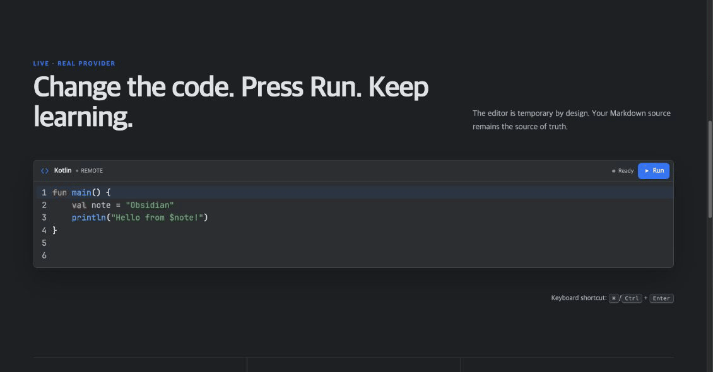

# Runnable Code Blocks

<p align="center">
  <strong>Run code where you learn.</strong><br />
  Turn Markdown examples into temporary IntelliJ-inspired editors in Obsidian and static websites.
</p>

<p align="center">
  <a href="obsidian://show-plugin?id=runnable-code-blocks">Add to Obsidian</a>
  ·
  <a href="https://woonyong-kr.github.io/runnable-code-blocks/">Try the live editor</a>
  ·
  <a href="https://community.obsidian.md/plugins/runnable-code-blocks">View the Community page</a>
</p>



Runnable Code Blocks keeps explanations, editable examples, and results in one note:

- **21 exact language fences** — Kotlin, JavaScript, TypeScript, Python, SQL, Java, C, C++, Go, Rust, and more.
- **No execution server to host** — browser-native runners and named public providers work in Obsidian and the static adapter.
- **Portable Markdown** — the document stores ordinary `run-<language>` fences instead of plugin-specific state.
- **Disposable editing** — change and run a sample freely; reloading restores the Markdown source.
- **Visible execution boundaries** — every result names the browser or third-party provider that actually ran it.

## Try it in 60 seconds

1. Open [Runnable Code Blocks in Obsidian](obsidian://show-plugin?id=runnable-code-blocks), then install and enable it.
2. Paste this into a note:

````markdown
```run-kotlin
fun main() {
    val note = "Obsidian"
    println("Hello from $note!")
}
```
````

3. Open Reading view and select **Run**, or press <kbd>⌘</kbd>/<kbd>Ctrl</kbd> + <kbd>Enter</kbd> inside the editor.

The output appears directly beneath the code. **Reset** restores the current Markdown source; reloading the note discards all temporary edits.

## Where it helps

- Build programming notes that can be read and practiced in the same place.
- Turn tutorials and interview material into executable examples.
- Let readers experiment without copying every snippet into a separate IDE.
- Publish the same runnable Markdown through a static website adapter.

The UI follows an IntelliJ New UI-inspired editor and tool-window hierarchy: line numbers, Darcula syntax colors, a compact Run action, named provider status, and inline Output. Editors grow through 100 source lines plus two numbered editing lines before their own scrollbar appears.

## Supported languages

Version 0.2.6 defines the following stable fences. “Remote” means source is sent to the named provider; this project does not operate an execution server.

| Fence | Static web | Obsidian |
| --- | --- | --- |
| `run-javascript` | Wandbox → Web Worker | Wandbox → Web Worker |
| `run-typescript` | Wandbox → browser transpile/Worker | Wandbox → browser transpile/Worker |
| `run-python` | Wandbox | Wandbox |
| `run-sql` | Wandbox SQLite | Wandbox SQLite |
| `run-html` | Sandboxed preview iframe | Sandboxed preview iframe |
| `run-css` | Sandboxed preview iframe | Sandboxed preview iframe |
| `run-kotlin` | Kotlin Playground | Kotlin Playground |
| `run-java` | Wandbox | Wandbox |
| `run-c` | Wandbox | Wandbox |
| `run-cpp` | Wandbox | Wandbox |
| `run-go` | Wandbox | Wandbox |
| `run-rust` | Wandbox | Wandbox |
| `run-csharp` | Wandbox | Wandbox |
| `run-swift` | SwiftFiddle | SwiftFiddle |
| `run-ruby` | Wandbox | Wandbox |
| `run-php` | Wandbox | Wandbox |
| `run-r` | Wandbox | Wandbox |
| `run-scala` | Wandbox | Wandbox |
| `run-dart` | DartPad compile API → isolated frame | DartPad compile API → isolated frame |
| `run-lua` | Wandbox | Wandbox |
| `run-shell` | Wandbox | Wandbox |

## Execution and privacy

Code runs only after **Run** or the keyboard shortcut. Treat every runnable block as executable code.

- Remote execution is enabled and remote-first by default so the same Markdown works on a static deployment.
- Settings can choose browser-first or disable remote execution. With remote execution disabled, only JavaScript, TypeScript, HTML, and CSS have browser-native adapters.
- JavaScript and transpiled TypeScript run in a fresh Web Worker with common network globals blocked, a five-second timeout, and termination after every run.
- HTML/CSS render in a sandboxed, script-disabled iframe with a restrictive Content Security Policy.
- Kotlin Playground, Wandbox, SwiftFiddle, and DartPad receive source only when their adapter is selected.
- The Community Plugin does not access the filesystem, spawn local processes, install runtimes, or modify `PATH`.

A fallback occurs only when execution is known not to have started. Compilation errors, program failures, timeouts with an unknown remote outcome, and non-zero exits never cause the same code to run again through another provider. See [runtime provider architecture](docs/runtime-providers.md) for the full contract.

## Settings

Open **Settings → Community plugins → Runnable Code Blocks**:

- **Remote execution** — allow or block source submission to named providers.
- **Provider order** — choose Remote → Browser or Browser → Remote.
- **Supported languages** — inspect the complete runtime map from the same catalog used by the plugin.

## Troubleshooting

- **Run is unavailable:** hover or focus the status text to see which provider preflight failed. Public providers can be temporarily unavailable.
- **Only four languages work after disabling remote execution:** this is expected. JavaScript, TypeScript, HTML, and CSS are the browser-native adapters.
- **Edits disappeared after reload:** this is intentional. Change the Markdown source when you want to keep an example.
- **A program failed but no fallback ran:** compile errors, runtime failures, and unknown remote outcomes are completed attempts, so the plugin avoids executing the same code twice.

## Static website integration

The browser adapter recognizes ordinary rendered Markdown:

```html
<pre><code class="language-run-python">print("Hello")</code></pre>
```

It shares the fence parser, language catalog, runner composition, editor, and output UI with the Obsidian plugin. No API key, database, Vercel function, Supabase project, or project-owned backend is required. The deployed adapter is available as a [live 21-language demo](https://woonyong-kr.github.io/runnable-code-blocks/).

## Development

Requirements:

- Node.js 22 or later
- Obsidian 1.13 or later

```bash
npm ci
npm run verify
npm run smoke:remote
```

`npm run verify` runs TypeScript and ESLint checks, isolated tests with coverage, production builds, release-policy validation, and an npm package dry run. `npm run smoke:remote` intentionally submits the public sample programs to third-party providers, so results remain provider-dependent.

The build creates:

- `main.js`, `manifest.json`, and `styles.css` for Obsidian;
- `dist-site/` for the static browser adapter.

Provider URLs, compiler selection, request bodies, and response parsing live only in `src/runners/*-runner.ts`. Provider order is in `src/runner-composition.ts`; public support claims are in `src/supported-languages.ts`; deterministic samples are in `src/language-examples.ts`. See [Contributing](CONTRIBUTING.md), the [design system](docs/design-system.md), and [verification evidence](docs/verification.md).

## License

[MIT](LICENSE)
